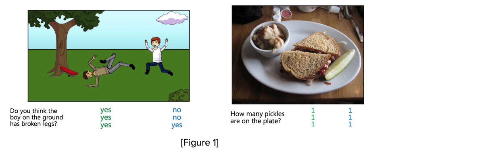
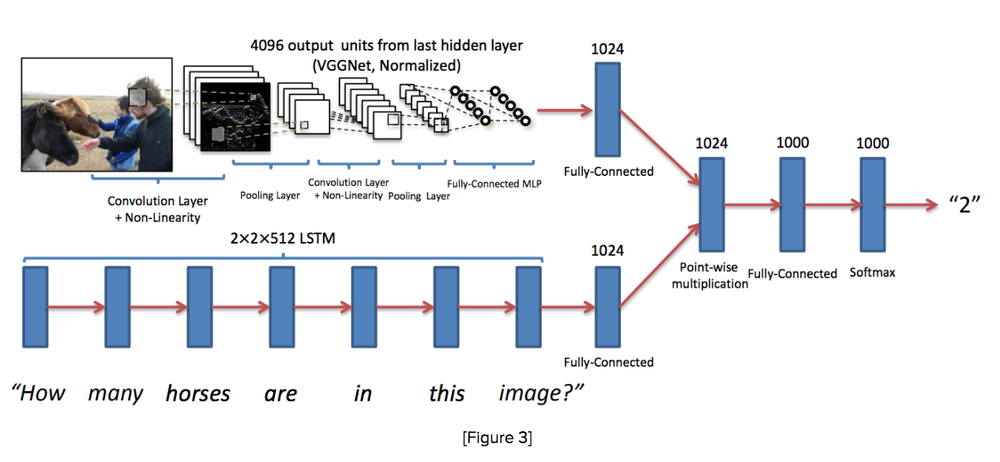
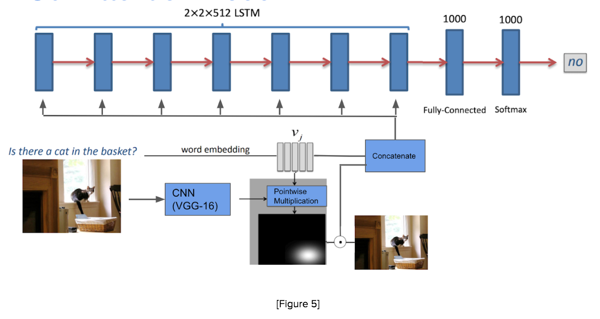

# Musecage Visual Question Answering Model

## Overview 
The goal of this project was to be able to build a network that would be able to answer a question about a given image. 

Examples of some images and answers are shown here. 

[Figure 1] We used the MSCOCO dataset for our model. The scenes are simple, and the questions below were generated from asking many people to write a question that is required to use the picture. The images with the questions were then given to others to answer the questions. We trained our model on the image, question pairs as our input, and the answers as our output.

This task can be broken down into three parts: *image embeddings, word embeddings, and recurrent attention*.

## Baseline Model 
The first model we tried is relatively simple. We use the [K-Nearest Neighbors](https://towardsdatascience.com/machine-learning-basics-with-the-k-nearest-neighbors-algorithm-6a6e71d01761) algorithm to find the most suitable answer to a given image, question pair in the following process. Using the question embeddings we find the K-nearest questions to the test question. From this set of K-questions, each of which map to an image, find the image embedding which is closest to the test image. The image closest to our image and its associated question give us our predicted answer (i.e. the most common answer given to that question paired with that image). This model achieved relatively poor results: Yes/No accuracy: 57.33%, Overall: 5.267%. Since this algorithm is very computationally expensive to train we didn’t train it on much data, and since KNN performance is highly dependent on the diversity of the data you train it on, training the KNN on more data could increase its performance.

## Image Embeddings 
We first pass each image into the pre-trained VGG-16, and embed it into a 4096-dimension vector taken from the final dense layer. This vector is then passed into a dense layer to output a 300-dim vector, which represents the features of our image.

## Word Embeddings 
The first thing we needed to do is to figure out how to represent our words.Word embeddings are used to represent relationships between words, providing a sense of context. As humans, we understand that language is naturally contextual, so we want our model to know that as well. We looked at three types: GloVe embeddings, Word2Vec, and RNN embeddings. 

#### GloVe Embeddings

GloVe embeddings incorporate global context by looking at all the words in a dictionary and keeping a co-occurrence matrix. The matrix contains semantic relationships formed from learning the likelihood of the next words to appear based on the previous words. 

We are using [pre-trained word vectors](https://nlp.stanford.edu/projects/glove/) (400k words, uncased, 50-300d vectors) for our question embeddings. To do so, we first format all our questions. After finding the word vectors for every word in the question, we add them up element-wise to form our question embedding. 

Since GloVe vectors encode the frequency distribution of which words occur near them, the embeddings have a concept of distance to determine similarity between questions. This way, the closer the Euclidean distance between two question embeddings, the more similar the questions are.

#### Word2Vec Embeddings

Word2Vec embeddings contain a more local context. We learn the weights to find the representation of the target word by a fully connected layer, and our output is the one hot encoding of the next word in the question, or our target word. If the outputted vector is similar to the expected one hot encoding of our target word, we have a good word embedding. After training this model over our entire dataset, we use this word embedding as our question embedding.

For our Word2Vec embeddings, we use the continuous bag of words (CBOW) model to train our net. In this case, we assume that there is only one word considered per context, which means the model will predict one target word given one context word. For training our neural network, our input is a one hot encoding of the context word. To make the one hot encoding, we take the top 1000 used words in our question set.

#### RNN Embeddings

Traditional networks do not have the capability to remember information from previous training inputs. Recurrent Neural Networks (RNNs) address this problem: they are networks that loop back on themselves, allowing information to persist from one training loop to another by saving it in a“cell state”. Passing in one word at a time from our input question to the RNN, we can encode the sequential and contextual information of each word to generate our question embedding.

For our model, we used a two-layer Long Short Term Model (LSTM) with 512 hidden units. An LSTM is a type of RNN that has both a “cell state” and a “hidden state”, which takes into account long-term dependencies of a sequential input. In a two-layer LSTM, each input word is passed through two LSTM units before looping back on itself for the next input word. The two layers add another hidden and cell state, which can capture more complex hierarchical structure in the sentence. 

Each input word in our input question is one-hot encoded in a Bag of Words model, and then padded our questions to account for variable question lengths. Each one-hot word vector from each question is then passed into the LSTM. We take the final cell state and hidden state from the last LSTM unit and concatenate them to form our question embedding.

## Attention 
The conceptual idea behind attention in machine learning is to give conditional focus to certain features of an input conditioned on that input. For instance, in the question “Do you like dogs or cats?” The words “like”, “dogs”, and “cats” are more important than “Do”, “you”, and “or”. Attention is an attempt at modeling this behavior. In our case we use visual attention, so instead of focusing on particular portions of a question we use the question to highlight the important features of the image. This can be thought of as pointing a flashlight at a certain part of an image in the dark, and using only what you see to answer a question. 

[Figure 4] In this picture attention allows our algorithm to focus on the image features that are important to the question, like things that look like phone booths.

## Our Models 

### Baseline FCNN

We first use VGG-16, a pre-trained convolutional neural network model, to understand our image and convert it to a 1024 fully connected layer. This “feature” vector is fed into a dense layer and provides a summary of the image. For the question, each word is fed into a dense layer and then an LSTM to generate an embedding. We concatenate the final hidden state and cell state and feed this embedding into a dense layer. The image vector and question vector are then fused through pointwise multiplication, and this final vector is fed into two dense layers with dropout. Finally, a softmax layer outputs the answer to the question by selecting the most probable outcome out of the top 1000 answer choices.

### Attention Model

In the paper that inspired our model they used two forms of attention: word based attention (i.e. the attention given to the image embedding based on each individual word in the question) and evidence or semantic attention (attention based on the entire question). Our model varies in that we use a recurrent model for our attention. Instead of combining the attention for each individual word with the attention for the entire question we allow our attention to be tuned sequentially through the question, similar to how a human would interpret a question about an image. 

First, the model embeds each image into a 4096-dimension vector using the final dense layer of VGG-16. This vector summarizes the features of the image, and is then passed into a dense layer to output a 300-dim vector. Each word of the question is then passed through Word2Vec to generate a vector that encapsulates the word’s meaning, which is then combined with the image vector through pointwise multiplication. This combination is passed through a softmax layer to output a “mask” that highlights where the word appears in the image. The mask is multiplied by the original image vector to reintroduce the image features, and then we concatenate this “attention image” with our initial word vector to create an image-word combination that tells the model where to look. To preserve the structure of the question, we feed each image-word vector into a two-layer LSTM. The LSTM outputs into two dense layers with dropout, and finally, the output is fed through a softmax layer to produce the answer.

### Classifier

We trained a question type classifier to predict the type of answer our input question was looking for: Yes/No, Number, or Other. Using Word2Vec embeddings for each word in the question, we passed the vector representation of each word into an LSTM with 512 hidden units. The final hidden and cell states of the LSTM are then concatenated to form our question embedding. That question embedding is finally fed through a dense network layer with softmax activation to output of the most likely answer type the question is looking for. After training the classifier on the entire dataset, it achieved an accuracy of 96%. 

_Sources: We are basing this project off of the paper [Ask, Attend and Answer: Exploring Question-Guided Spatial Attention for Visual Question Answering](https://arxiv.org/pdf/1511.05234.pdf). They combine an LSTM with a CNN in order to understand a question (LSTM) along with an image (CNN) well enough to provide an accurate answer._ 

